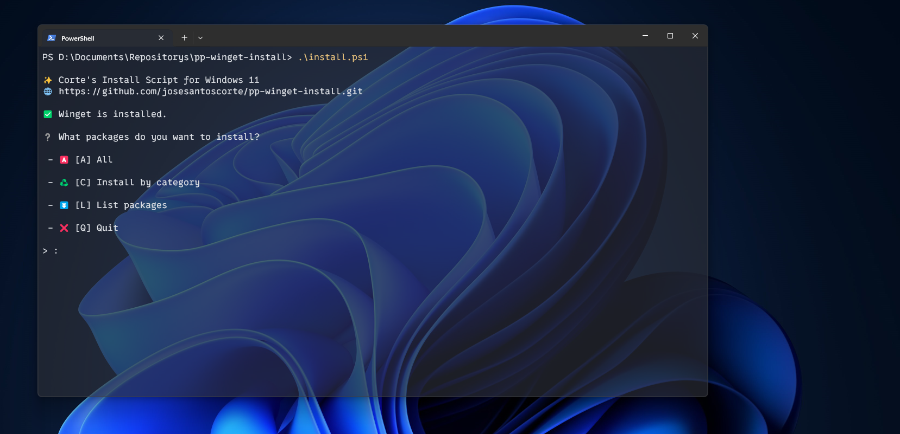

# pp-winget-install

A script to automate the installation of my day to day programs.



## Usage

To run the script, you need to have [winget] installed.

On PowerShell, inside the folder where the scrypt is installed, run the following command to execute the script:

```powershell
.\install.ps1
```

## Packages

### Communication

| Name | Id |
| --- | --- |
| Discord | Discord.Discord |
| WhatsApp | WhatsApp.WhatsApp |

### Media

| Name | Id |
| --- | --- |
| Stremio | Stremio.Stremio |
| Spotify | Spotify.Spotify |
| OBS Studio | OBSProject.OBSStudio |

### System

| Name | Id |
| --- | --- |
| 7-Zip 23.01 (x64 edition) | 7zip.7zip |
| Rufus | Rufus.Rufus |
| Core Temp 1.18.1 | ALCPU.CoreTemp |
| Adobe Acrobat (64-bit) | Adobe.Acrobat.Reader.64-bit |
| Chromium | Hibbiki.Chromium |

### Dev

| Name | Id |
| --- | --- |
| PowerShell 7-x64 | Microsoft.PowerShell |
| Microsoft Visual Studio Code (User) | Microsoft.VisualStudioCode |
| Godot Engine | GodotEngine.GodotEngine |

### System Drivers

| Name | Id |
| --- | --- |
| VIA | Olivia.VIA |
| Wacom Tablet | Wacom.WacomTabletDriver |

### Network

| Name | Id |
| --- | --- |
| OpenVPN 2.6.8-I001 amd64 | OpenVPNTechnologies.OpenVPN |
| qBittorrent | qBittorrent.qBittorrent |
| MEGAsync | Mega.MEGASync |

### Games

| Name | Id |
| --- | --- |
| Epic Games Launcher | EpicGames.EpicGamesLauncher |
| Ubisoft Connect | Ubisoft.Connect |
| Steam | Valve.Steam |

### TODO
- Add NVIDIA Drivers
- Add Wireshark
